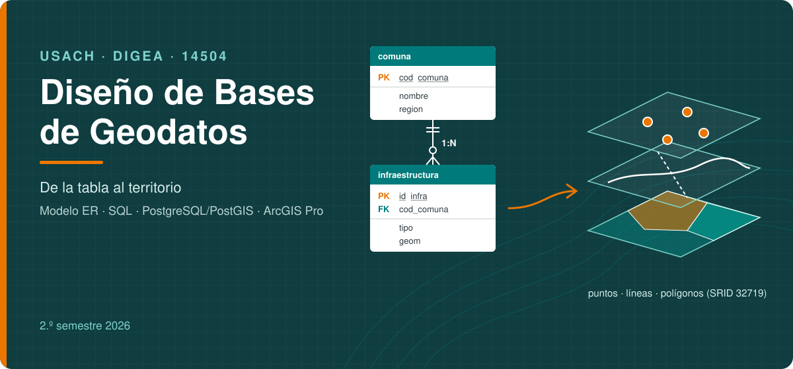

<div style="text-align: center;">
  
</div>

<div style="text-align: center;">
  <h1>Diseño de Bases de Geodatos (DBG · 14504)</h1>
  <p>
    <strong>Universidad de Santiago de Chile</strong><br>
    <strong>Facultad de Ingeniería</strong><br>
    <strong>Departamento de Ingeniería Geoespacial y Ambiental</strong><br>
    <strong>Ingeniería Civil en Territorio y Medioambiente</strong><br>
    <em>2do Semestre 2026 · 21 de septiembre de 2026 – 15 de enero de 2027</em>
  </p>
</div>

---

### 📋 Índice de Contenidos

1.  [Bienvenida](#-bienvenida)
2.  [Capacidades que adquirirán en el curso](#-capacidades-que-adquirirán-en-el-curso)
3.  [Contenido del Curso](#-contenido-del-curso)
    * [Cátedra](#cátedra)
    * [Laboratorio](#laboratorio)
    * [Proyecto integrador](#proyecto-integrador)
4.  [Calendario](#-calendario)
5.  [Evaluación](#-evaluación)
6.  [Software requerido](#-software-requerido)
7.  [Cómo Clonar este Repositorio](#-cómo-clonar-este-repositorio)
8.  [Acerca del Profesor: Ignacio Yáñez Henríquez](#-acerca-del-profesor-ignacio-yáñez-henríquez)

---

## 👋 Bienvenida

<div style="text-align: justify;">
Bienvenidas y bienvenidos al curso de Diseño de Bases de Geodatos. En esta asignatura aprenderán a construir, desde cero, la base de datos que sostiene cualquier análisis territorial. Partiremos por las bases de datos relacionales con un caso clásico que todos conocen, <strong>el registro académico universitario</strong>, y luego llevaremos lo aprendido al territorio: levantar requerimientos, modelar la información, implementarla en un sistema gestor de bases de datos, generar y procesar geodatos y responder preguntas reales con SQL espacial. Primero construiremos la información y, cuando sea confiable, la llevaremos al mapa.
</div>
<br>
<div style="text-align: justify;">
Desde la semana 8 el caso de clase pasa a ser territorial: <strong>la exposición de infraestructura crítica a incendios forestales en la Región de Valparaíso</strong>, con SENAPRED como cliente. En paralelo, cada equipo desarrollará su propio proyecto integrador sobre un problema territorial o medioambiental de Chile, como el manejo de una cuenca o una zona de sacrificio.
</div>
<br>
<div style="text-align: center;">
  
</div>

---

## 💡 Capacidades que adquirirán en el curso

Al finalizar la asignatura, serás capaz de **implementar una base de geodatos relacional para un problema territorial o medioambiental**, a partir de requerimientos y modelos conceptual y lógico, mediante SQL y operaciones espaciales, con criterios de integridad, interoperabilidad, trazabilidad y eficiencia. En concreto:

* **Modelado de datos (caso clásico y territorial):** levantamiento de requerimientos, reglas de negocio, diccionario y catálogo de entidades (ISO 19109/19110), modelos ER/EER y normalización hasta 3FN.
* **SQL, PostgreSQL y PostGIS:** definición, carga, consulta y control de datos con restricciones, vistas, transacciones y roles.
* **Geodatabase y geoprocesos:** diseño de geodatabases en ArcGIS Pro (dominios, subtipos, relationship classes, topología) y geoprocesos básicos (selección, buffer, clip, intersect, dissolve, spatial join, near).
* **Bases de datos espaciales:** PostGIS, tipos de geometría, sistemas de referencia, validez, índices espaciales y metadatos.
* **SQL espacial:** predicados, joins espaciales, vecino más cercano y operaciones geométricas, contrastados con sus geoprocesos equivalentes.
* **Comunicación técnica:** documentación reproducible, control de calidad y mapas para la toma de decisiones.

---

## 📚 Contenido del Curso

### **Cátedra**
* 🎞️ [0. Presentación del curso](Cátedra/0.%20Presentación%20del%20curso)
* 🎞️ [1. Diseño conceptual y lógico](Cátedra/1.%20Diseño%20conceptual%20y%20lógico)
* 🎞️ [2. Implementación relacional y SQL](Cátedra/2.%20Implementación%20relacional%20y%20SQL)
* 🎞️ [3. Datos espaciales y geoprocesos (incluye Módulo G)](Cátedra/3.%20Datos%20espaciales%20y%20geoprocesos)
* 🎞️ [4. Consultas espaciales y proyecto](Cátedra/4.%20Consultas%20espaciales%20y%20proyecto)
* 📄 [Bibliografía y respaldo académico](Cátedra/Recursos/Bibliografia.md)
* 📄 [Programa oficial de la asignatura](Programa)
* 🎥 [Videos de clase](Videos/README.md)

### **Laboratorio**
* 👨‍💻 [Cómo usar el material de laboratorio](Laboratorio/README.md)
* 🧩 [Plantilla de modelo lógico en draw.io (1:1, 1:N, N:M, entidad fuerte y débil)](DBG_2s_2026_APELLIDONOMBRE.drawio)
* 📝 [Guías de ejercicios por unidad](Laboratorio/Guías)
* ✅ [Respuestas de las guías](Laboratorio/Soluciones) (las soluciones SQL están en cada carpeta de `sql/`)
* 🧭 [Lab autónomo C · Modelo relacional (semana 4)](Laboratorio/Guías/Lab_C_Modelo_Relacional.md)
* 🧭 [Lab autónomo A · PostgreSQL (semana 6)](Laboratorio/Guías/Lab_A_PostgreSQL.md)
* 🧭 [Lab autónomo B · Geoprocesos en ArcGIS Pro (semana 12)](Laboratorio/Guías/Lab_B_ArcGIS_Pro.md)
* 🗄️ [Scripts SQL · caso clásico: registro académico (U1–U2)](Laboratorio/sql/01_caso_academico)
* 🗄️ [Scripts SQL · caso territorial: incendios (U3–U4)](Laboratorio/sql/02_caso_incendios)
* 🗺️ [Datos del caso (CSV y GeoPackage)](Laboratorio/datos)

### **Proyecto integrador**
* 🎯 [Enunciado, hitos y rúbricas](Proyecto/Enunciado_y_Rubricas.md)

---

## 📅 Calendario

| Sem. | Fechas | Contenido | Evidencia |
|---|---|---|---|
| 1 | 21–25 sep | SGBD, niveles de abstracción, esquema e instancia · caso clásico: registro académico | Diagnóstica |
| 2 | 28 sep–2 oct | Presentaciones de los estudiantes: modelado conceptual | Hito P0 |
| 3 | 5–9 oct | Requerimientos, modelado del espacio geográfico (ISO 19109/19110) y modelo ER | — |
| 4 | 12–16 oct | **Sin clase presencial:** Lab autónomo C (modelo relacional y 3FN) | Lab C |
| 5 | 19–23 oct | EER y FNBC · instalación de PostgreSQL y PostGIS | Control 1 · Hito P1 |
| 6 | 26–30 oct | **Sin clase presencial:** Lab autónomo A (implementar el registro académico) | Lab A |
| 7 | 2–6 nov | DDL, dominios, DML y carga · de latitud y longitud a geometría | Lab 7 |
| 8 | 9–13 nov | Consultas y JOIN · entra el caso territorial (parte relacional) | Lab 8 |
| 9 | 16–20 nov | Vistas, transacciones y roles · PostGIS sobre el caso territorial | Control 2 · Hito P2 |
| 10 | 23–27 nov | ArcGIS Pro I: geodatabase del caso y conexión a PostGIS | Lab 10 |
| 11 | 30 nov–4 dic | Geoprocesos y su SQL equivalente · ArcGIS Pro II · ModelBuilder | Lab 11 |
| 12 | 7–11 dic | **Sin clase presencial:** Lab autónomo B | Lab B |
| 13 | 14–18 dic | SQL espacial, calidad e índices GiST · cierre práctico el 15 dic | Control 3 · Hito P3 |
| 14 | 21–24 dic | Cátedra de cierre U3–U4 y asesoría de proyecto | — |
| 15 | 28 dic–1 ene | Receso navidad y año nuevo | — |
| 16 | 4–8 ene | Asesorías de proyecto y publicación de resultados | Prueba · Hito P4 |
| 17 | 11–15 ene | Defensas del proyecto integrador | Proyecto final |

> Fechas según el calendario académico 2026 de la VRA. Cualquier ajuste se informa por la plataforma del curso y se actualiza en este repositorio.

---

## 📊 Evaluación

| Instrumento | Semana | Ponderación |
|---|---|---|
| Controles 1, 2 y 3 (individuales) | 5, 9, 13 | 30 % |
| Laboratorios C, A, 7, 8, 10, 11 y B (se elimina la nota más baja) | 4–12 | 20 % |
| Prueba individual integradora | 16 | 20 % |
| Proyecto integrador (hitos 10 %, informe 10 %, defensa 10 %) | 2–17 | 30 % |

Para aprobar se requiere, además, un promedio de controles y prueba igual o superior a 4,0.

---

## 🧰 Software requerido

| Software | Desde | Uso |
|---|---|---|
| [PostgreSQL 16](https://www.postgresql.org/download/) + PostGIS 3.4 (Stack Builder) | Semana 5 | Motor de base de datos |
| pgAdmin 4 (incluido en el instalador) | Semana 5 | Cliente de administración y consultas |
| ArcGIS Pro (licencia académica USACH) | Semana 10 | Geodatabase, geoprocesos y mapas |
| [draw.io](https://app.diagrams.net/) | Semana 3 | Diagramas ER |
| [Git](https://git-scm.com/downloads) | Semana 1 | Descargar y actualizar este repositorio |

---

## 🚀 Cómo Clonar este Repositorio

Para tener una copia local de todos los materiales del curso en tu computador, sigue estos sencillos pasos.

### Requisitos

* Tener [Git](https://git-scm.com/downloads) instalado. Puedes verificar si lo tienes abriendo una terminal y escribiendo `git --version`.

### Pasos para la Clonación

1.  **Abre una terminal** (Terminal cmd, PowerShell, o Git Bash).

2.  **Elige una ubicación** en tu computador donde quieras guardar los archivos del curso. Por ejemplo, el Escritorio o tu carpeta de Documentos.
    ```bash
    # Ejemplo: para ir a la carpeta de Documentos
    cd Documentos
    ```

3.  **Clona el repositorio** usando el siguiente comando (se recomienda HTTPS por ser más sencillo):

    * **Opción 1 (HTTPS):**
        ```bash
        git clone https://github.com/iyanezUSACH/DBG_2s_2026.git
        ```

    * **Opción 2 (SSH, para usuarios avanzados):**
        ```bash
        git clone git@github.com:iyanezUSACH/DBG_2s_2026.git
        ```

4.  **Ingresa a la carpeta** que acabas de crear:
    ```bash
    cd DBG_2s_2026
    ```

✅ ¡Listo! Ahora tienes todos los archivos del curso en tu computador. Para actualizarlos más adelante, solo necesitarás navegar a esta carpeta y ejecutar el comando `git pull`.

---

## 👨‍🏫 **Acerca del Profesor: Ignacio Yáñez Henríquez**

<div style="text-align: justify;">
¡Bienvenidas y bienvenidos! Soy Ignacio Yáñez Henríquez, Ingeniero Civil en Geografía titulado de esta misma casa de estudios, la Universidad de Santiago de Chile 🎓, y actualmente estudiante del Doctorado en Innovación Tecnológica en Ingeniería (DITI) de la USACH, donde investigo la representación geoespacial del riesgo territorial complejo.

Mi carrera profesional de **más de 15 años** 💼 se ha centrado en conectar el análisis espacial con soluciones tecnológicas de alto impacto. He liderado y gestionado proyectos SIG en la gran minería, en **Codelco División El Teniente** ⛏️, y hoy me desempeño como **Senior Solution Architect en Esri Chile SpA** 🗺️, donde diseño arquitecturas de datos geoespaciales, geodatabases corporativas y soluciones de GeoAI para organizaciones públicas y privadas.

Complementé mi formación con un **Máster en Big Data y Data Science** 📊, con dominio de **Python, bases de datos SQL y NoSQL** y herramientas de visualización. En este curso 🎯 quiero que aprendan lo que la industria y las instituciones del Estado necesitan hoy: datos bien diseñados, confiables y trazables, que después se conviertan en decisiones sobre el territorio.
</div>

**🔗 Contacto y Redes Profesionales:**
* **LinkedIn:** [Ignacio Yáñez Henríquez](https://www.linkedin.com/in/ignacio-ya%C3%B1ez-henriquez/)
* **Correo Institucional:** [ignacio.yanez.h@usach.cl](mailto:ignacio.yanez.h@usach.cl)
